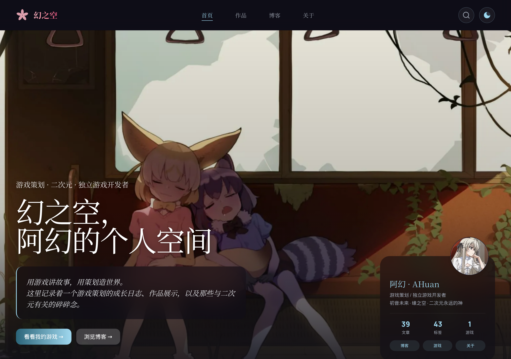

# Astro Sakura Blog

[](https://astro.build)
[](https://tailwindcss.com)
[](LICENSE)

一款精美的 Astro 6 博客模板，樱花主题设计，内置自研音乐播放器。

[**在线演示**](https://huannan.top) | [**English**](README.md)


<details>
<summary>更多截图</summary>

### 暗色模式


### 博客列表


### 文章页


### 移动端


</details>

## 特性

- **樱花主题** — 毛玻璃效果、渐变配色、流畅动画
- **内置音乐播放器** — 自研播放器，支持播放列表、双语歌词同步、Apple Music 风格模糊封面、拖拽移动、MediaSession API（键盘媒体键、系统通知栏控制）
- **深色 / 浅色模式** — 18:00 后自动切换暗色，支持手动切换
- **全文搜索** — 基于 Fuse.js 的客户端搜索
- **页面过渡动画** — Astro View Transitions 丝滑切页
- **系列文章导航** — 多篇文章自动生成上一篇/下一篇
- **文章定制 BGM** — 通过 frontmatter 为每篇文章设置背景音乐
- **评论系统** — 可选的 Waline 集成
- **RSS 订阅** — 自动生成
- **SEO 优化** — JSON-LD、OpenGraph、Twitter Cards、sitemap
- **移动端适配** — 底部导航栏、触控友好的播放器
- **阅读进度条** — 滚动时显示阅读进度
- **代码一键复制** — 代码块右上角复制按钮
- **图片灯箱** — 点击图片放大查看

## 快速开始

```bash
# 克隆仓库
git clone https://github.com/HuanNan520/astro-sakura-blog.git
cd astro-sakura-blog

# 安装依赖
npm install

# 启动开发服务器
npm run dev

# 构建生产版本
npm run build
```

## 配置

所有配置集中在一个文件：**`src/config.ts`**

```typescript
export const siteConfig = {
  name: "我的博客",                    // 站点名称
  description: "我的个人博客",         // SEO 描述
  url: "https://myblog.com",          // 部署后的网址
  language: "zh-CN",                  // "zh-CN" | "en" | "ja"

  author: {
    name: "你的名字",
    tagline: "写作者 / 开发者 / 创作者",
    avatar: "/images/avatar.png",
    motto: "你最喜欢的一句话。",
  },

  // ... 更多配置：Hero 区、名言、项目、社交链接、评论、统计分析
};
```

完整配置参考请查看 `src/config.ts`，每个字段都有注释说明。

## 写文章

在 `src/content/blog/` 下创建 `.md` 或 `.mdx` 文件：

```yaml
---
title: "文章标题"
summary: "简短摘要"
date: 2026-01-01
cover: "../../assets/images/covers/cover-1.webp"  # 可选
tags: ["标签1", "标签2"]
bgm: "歌曲名"              # 可选：打开文章时自动播放
series: "系列名"            # 可选：归入系列
seriesOrder: 1              # 可选：系列中的顺序
---

文章内容...
```

## 音乐播放器

在 **`src/data/playlist.ts`** 中添加歌曲：

```typescript
export const instrumental: Song[] = [
  { name: '曲名', artist: '歌手', url: '/music/song.mp3', cover: '/images/covers/cover.webp' },
];

export const vocal: Song[] = [];

export const lyrics: Record<string, LyricLine[]> = {
  '曲名': [
    { time: 0.0, ja: '（前奏）', zh: '' },
    { time: 15.0, ja: '第一句歌词', zh: '翻译' },
  ],
};
```

MP3 文件放在 `public/music/`，封面图放在 `public/images/covers/`。

没有配置歌曲时播放器会显示友好的空状态提示，不会报错。

## 评论系统

1. 部署 [Waline](https://waline.js.org)（可免费托管在 Vercel）
2. 在 `src/config.ts` 中填入你的服务端地址：
   ```typescript
   comments: { serverURL: "https://your-waline.vercel.app" }
   ```

`serverURL` 留空则自动隐藏评论区。

## 部署

### Cloudflare Pages

1. 推送到 GitHub
2. 在 Cloudflare Pages 控制台连接仓库
3. 构建命令：`npm run build`
4. 输出目录：`dist`

### Vercel / Netlify

零配置 — 直接连接仓库即可。

## 技术栈

- [Astro 6](https://astro.build) — 静态站点生成器
- [Tailwind CSS v3](https://tailwindcss.com) — 原子化 CSS
- [MDX](https://mdxjs.com) — Markdown + 组件
- [Fuse.js](https://www.fusejs.io) — 模糊搜索
- 自托管字体：Manrope + 思源宋体

## 项目结构

```
src/
├── config.ts              # 站点配置（改这个文件就够了）
├── data/playlist.ts       # 音乐播放器数据
├── layouts/Base.astro     # 主布局
├── pages/
│   ├── index.astro        # 首页
│   ├── blog/              # 博客列表 & 文章详情
│   ├── projects.astro     # 项目展示
│   ├── about.astro        # 关于页
│   ├── tags.astro         # 标签云
│   └── archives.astro     # 归档
├── components/
│   ├── MusicPlayer.astro  # 内置音乐播放器
│   ├── Footer.astro
│   └── ...
├── content/blog/          # 你的博客文章（.md/.mdx）
└── styles/global.css      # 全局样式
```

## 许可证

MIT
